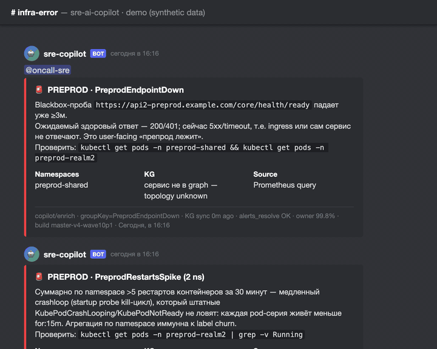

# SRE AI Copilot

[](LICENSE)
[](https://www.python.org/)
[](tests)
[](.github/workflows)
[](CHANGELOG.md)

**Homepage:** [sre.froggychips.xyz](https://sre.froggychips.xyz) · **Stack:** FastAPI + Celery + Postgres-KG + LLM + MCP

> **Let an AI run incident response for Kubernetes — without letting it touch prod on a hunch.** Whether to apply a `kubectl` fix is decided by a deterministic policy engine (8 risk axes), *not* taken from the model's answer — so the copilot is safe to put next to production. KG-first enrichment, multi-hypothesis RCA, controlled remediation, and honest about its own blind spots.

> **[English](#english) · [Русский](#русский)**



*Live output formats on synthetic data: user-facing endpoint-down critical with a `kubectl` hint, slow-crashloop catcher, deploy-regression enrichment with blast radius, KG upstream-cascade reasoning, resolved notice and the daily cluster digest. Source page: [docs/assets/demo-alerts.html](docs/assets/demo-alerts.html).*

---

<a name="english"></a>
## English

**SRE AI Copilot** is a backend service that turns Prometheus AlertManager webhooks into either an **advisory analysis** (default) or an **auto-remediation with human approval** (opt-in) of a Kubernetes incident — root cause + recommended actions, posted as a Discord embed.

> **Default = advisory mode.** With out-of-the-box settings (`EXECUTOR_ENABLED=false`, `EXECUTOR_APPROVAL_ENABLED=false`) the copilot does **not** call `kubectl` — it analyzes, posts to Discord, and stops. Engineer acts manually.
>
> **Opt-in = auto-remediator with approval.** Setting `EXECUTOR_ENABLED=true` adds a 9th pipeline stage that validates the proposed action against `kube-apiserver` via `kubectl ... --dry-run=server`. Setting `EXECUTOR_APPROVAL_ENABLED=true` additionally shows an «⚙️ Apply» button on the Discord embed (only when dry-run passed and risk ≤ medium); two-click confirmation → real `kubectl` under `K8sSecurityGuard` with full OTEL audit. See [Roadmap → Execution](#roadmap--execution) below for the ramp-up plan.

### What's new

- **v1.0.0-rc.14 / rc.15 — the two-day silent digest outage, dissected**:
  after the rc.10–13 wave the daily digest silently vanished for two days.
  Two independent killers: (1) workers OOM-looped every ~1.5–2h (1536Mi
  limit + 98% CPU throttling at 200m) — with `acks_late` redis redelivered
  the task hourly until `expires` quietly revoked it; (2) the digest builder
  interleaves SQL with minutes of VM/Discord I/O, so its session idled in
  transaction past the 120s kill limit introduced in rc.11. Fixes:
  `recompute_all_health` commits in batches of 100 with `ORDER BY id`
  (deadlocks on `kg_services`: 594/day → 0), `metrics_sync` closes its read
  transaction before the fetch phase, digests run on a read-only
  **AUTOCOMMIT session** (nothing left to idle, no ACCESS SHARE locks held
  against DDL), worker gets 3Gi/600m (Guaranteed QoS).
- **v1.0.0-rc.12 / rc.13 — deep-review wave tail**: ingress observations in
  5 VM queries instead of ~5000 per tick; NATS edges for squad/QA stands
  (the root of low graph connectivity); a "KG via MCP" digest section
  (who actually uses the graph); repo ↔ cluster drift eliminated (registry,
  RBAC, `lock_timeout`); `acks_late` + `reject_on_worker_lost` +
  `prefetch=1`; hanging transactions and the renamed-constraint crash fixed.
- **v1.0.0-rc.11 — KG node types, honest metrics, lock-safe migrations**:
  `kg_services` gained `node_kind` (`service` / `workload` / `ingress`), so a
  k8s Service and its backing Deployment are finally **different nodes**.
  Until now they shared one row keyed by `(namespace, name)`, which meant the
  `serves_traffic` edge could not exist at all — it always degenerated into a
  self-loop and was dropped. On the live graph that was 2092 discarded edges
  per sync tick against 3 surviving ones; after the change `serves_traffic`
  holds 4234 edges and matching covers StatefulSet/DaemonSet (all `*-db`
  nodes, previously invisible).
  **Metrics stay honest:** `orphan_pct` deliberately does NOT count
  `serves_traffic` as connectivity — that edge links a node to its own
  implementation, and counting it dropped orphan from 72.5% to 42% without a
  single new integration. `owner_pct` and `app_scope` count `service` nodes
  only, so 2871 new workload nodes did not dilute them.
  **Operations:** migrations run with `lock_timeout` (a queued DDL blocks
  every reader behind it), periodic beat tasks now expire instead of piling up
  (230 queued tasks starved the topology sync completely), and CI runs the
  full suite against a live Postgres. Full write-up, including the mistakes
  made along the way: [`docs/POSTMORTEM_2026_08_08.md`](docs/POSTMORTEM_2026_08_08.md).
- **v1.0.0-rc.1 — Security & reliability hardening (release candidate)**: the
  largest hardening pass to date — closes the full CRITICAL/P0 tier from an
  internal deep review and makes the opt-in executor genuinely safe.
  **Executor:** a deterministic server-side policy gate (`app/remediation`,
  8 risk axes) recomputes risk from the *structured* intent and blocks
  prod/system/data-plane/irreversible actions — the LLM `risk` field is now
  advisory only; the `apply_confirm` path carries the intent signature
  (TOCTOU), and `apply_intent` requires a matching signature **and** a
  recorded `ActionApproval` before any real `kubectl`, with a row-lock against
  double-apply. **Webhooks:** anti-replay timestamp-freshness on both the
  Discord interactions (Ed25519) and AlertManager (HMAC) endpoints.
  **Reliability:** retry-storm fix (SDK `max_retries=0` + client timeout +
  narrowed retry predicate — no more 9× fan-out / zombie requests),
  AlertManager-down no longer false-resolves live critical alerts, incident
  dedup moved to a cross-replica Postgres store (no duplicate `@here`),
  savepoint-isolated KG synchronizers (one bad row no longer kills the tick),
  a single Celery app with backpressure, and prompt-guard no longer
  false-blocks real crash tracebacks. **Plus:** PII-redaction gaps
  (AWS/Basic/PEM), `/replay` RBAC + SSRF allowlist, VM None-sentinel (no
  false-healthy snapshot), RCAExplainer fail-safe approval gating, DB-pool
  tuning, psycopg2 leak fix. ~22 fixes; full suite 1591 passed.
- **v0.14.0 — Alert-quality: noise suppression + ops hardening**: two new
  render-time suppression classes that keep noisy alerts *visible but muted*
  (grey + 🔇, no 🚨/@mention) instead of dropping or demoting them. `meta_noise`
  catches always-noisy meta-aggregates (`*NewCriticalAlerts`,
  `etcdInsufficientMembers`, `ScrapePoolHasNoTargets`, `RecordingRulesNoData`) —
  each real critical still arrives as its own loud card. `gen_mismatch_noise`
  catches *conditional* `KubeDeploymentGenerationMismatch` churn (external
  controller bumps `metadata.generation`, rollout already converged): muted
  **only** when replicas `ready==desired (≥1)`; fail-safe **LOUD** when
  `ready<desired`/unknown so a genuinely stuck rollout still rings in any
  namespace, including prod. Both gated by kill-switches (`META_NOISE_ENABLED`,
  `GEN_MISMATCH_NOISE_ENABLED`). Ops: `copilot-beat` memory 128Mi→256Mi
  (OOMKill crashloop fix), `cryptography`/`pydantic-settings` declared as
  first-party deps (CI-drift + CVE fix).
- **v0.13.0 — Security Hardening + Remediation Phase A**: authz/integrity
  hardening across the executor/approval paths (closed apply/approve gaps,
  removed response leaks, authz on previously-open handles incl. `/stats`),
  PromQL-injection + SQLAlchemy session-leak + webhook insert-race fixes,
  pipeline state-machine correctness (per-stage timeout, `TRIAGE_REQUIRED` in
  the terminal skip-set). Remediation **Phase A** foundation: decision
  *preview without executor* (8 discrete risk axes, YAML playbooks, rule-based
  policy evaluator) + ownership manifest for `*-shared` infra; resilience
  primitives wired into the hot-path.
- **2026-06-10 — KG ingress coverage live**: nginx-ingress metrics enabled on
  both WO controllers (shared + prod); `kg_ingress_observations` is now
  populated every ~10 min with per-host/path p95/p99/rps/4xx/5xx, 100% of
  rows linked to `kg_services`. Caveat: per-service `http_5xx_rate` /
  `p95_latency_ms` in `kg_service_health` are still always 0 — app `/metrics`
  (Kestrel) is behind JWT; pending backend ticket WO-12483.
- **v0.12.0 — Wave 8 (KG Metadata + UX Polish)**: k8s Jobs/CronJobs coverage
  (`kg_k8s_jobs`, `runs_as_job` edge), PVC/PV storage subgraph (`kg_storage_volumes`,
  `uses_volume` + `bound_to` edges in `kg_volume_edges`), multi-signal owner
  inference (prefix + deploy-history + labels + manual override), `stale_class`
  column on `kg_services` (active/expected_stale/suspicious_stale), formal
  KG schema/quality contract v2.2 (`app/knowledge_graph/contract.py` +
  `docs/KG_SCHEMA_CONTRACT.md`), Discord embed UX polish (PATCH-dedup,
  human-time, pod trail), stats digest UX overhaul (trends, unowned action
  block, blast-radius rename), `quality_report` CLI + 7-case snapshot fixtures
  gallery for UX regression-guard.
- **v0.11.0 — Wave 7 (Topology Expansion)**: PodEvent ↔ ServiceEdge runtime
  correlation (cheap OTEL-substitute, confirms existing edges), declarative
  k8s Service + Ingress parser (new `serves_traffic` + `routes_to` edges),
  NATS subjects parser from monorepo source (subject-level pub/sub direction
  on `uses_nats` edges).
- **v0.9.0–v0.10.0 — Active observability layer (Wave 1–6)**: VictoriaMetrics
  time-series materialization (`kg_service_health`), anomaly detection
  (robust-z + seasonal baseline), deploy ↔ incident correlator, Seq logs
  integration, daily team digest, Discord pipeline overhaul (dedup, severity
  routing, per-team channels), PII redaction, Approve/Decline authz, KG
  self-health canary.

### What it does

- Receives AlertManager webhooks (`POST /webhooks/alertmanager`).
- **Fingerprint deduplication**: skips re-running the pipeline for alerts already in-flight (OPEN → RESOLVED). Only FAILED incidents are retried.
- **Flapping detection**: if an alert fires after RESOLVED, increments `flap_count` and re-runs the pipeline with explicit context — "this alert has cycled N times; RESOLVED was likely premature."
- Runs `DiagnosticsEngine` — deterministic rules produce a typed `FactStore` (OOM killed, process crash, crashloop, …) before any LLM call.
- Detects **fact conflicts** (`oom_killed` + `process_crash` both true = contradiction → confidence capped, `<conflicts>` block injected into prompts).
- Runs a **multi-hypothesis fan-out** across 4 perspectives (app / infra / deps / runtime) filtered by `PERSPECTIVE_PRECONDITIONS`, then adversarially grounds each hypothesis against the `FactStore` via `FactCriticAgent`.
- Enriches context with **cluster-wide health snapshot** at incident time: nodes ready, pod failures, crashloops, CPU/mem/disk peak, firing alert counts — same metrics as the `#stats` daily report. Lets the LLM distinguish "isolated pod issue" from "cluster-wide pressure."
- Supports **Node\* alerts** (NodeDiskIOSaturation, NodeMemoryWillExhaustSoon, …): `instance`/`node` labels are used for enrichment and displayed in the Discord embed instead of `pod`.
- **Alert-quality noise suppression**: meta-aggregate alerts (`*NewCriticalAlerts`, control-plane scrape-gap derivatives) and *conditional* `KubeDeploymentGenerationMismatch` churn are rendered **muted** (grey + 🔇, no 🚨/@mention) rather than dropped — visible for eyeballing but never paging. `gen_mismatch_noise` is health-gated (muted only when `ready==desired`, LOUD otherwise); both classes have kill-switches. Distinct from the input-level `ALERT_SUPPRESS_NAMES` drop and from `rollout_noise` deploy-window suppression.
- Enriches context from **Atlassian Jira** (open/resolved tickets for the service), **TeamCity** (recent deploys), and **VictoriaMetrics** (memory/CPU window per pod + cluster health).
- Detects **recurrence**: same service resolved < 7 days → `FixAgent` switches to investigative mode (no restart recommendations).
- Posts a **single Discord embed** per incident (title + root cause + synthesis + feedback buttons), replacing the previous two-message flow.
- **👍 / 👎 feedback buttons** on every embed: 👍 saves immediately; 👎 requires a two-step confirmation ("Confirm: was the model's *analysis* wrong?") to prevent accidental negative feedback. Stored in `IncidentRecord.user_feedback`.
- **Structured `ExecutionIntent`** alongside prose: `FixAgent` emits JSON in the `ExecutionIntent` schema (`action`, `resource_type`, `resource_name`, `namespace`, `params`, `risk`); pydantic-validated, `FORBIDDEN_NAMESPACES` rejected at parse time, persisted to `IncidentRecord.analysis.execution_intent`.
- **Executor stage** (opt-in via `EXECUTOR_ENABLED=true`): server-side dry-run of the intent (`kubectl ... --dry-run=server`) under `K8sSecurityGuard`; result captured in `executor_result` and shown as a "Dry-run verdict" field on the Discord embed.
- **Discord Apply button** (opt-in via `EXECUTOR_APPROVAL_ENABLED=true`): two-click confirmation on the embed → invokes `K8sService.execute_intent(intent, dry_run=False, post_approval=True)`; idempotency by `incident_id`, eligible only when dry-run passed and risk ∈ {low, medium}; HIGH-risk and ineligible incidents never get the button.
- **Approve / Decline buttons** are gated by the *same* `EXECUTOR_APPROVAL_ENABLED` flag. Previously the green «Approve & Run» button rendered whenever an `execution_intent` existed and the bot could post, and its handler dispatched the real write on `EXECUTOR_ENABLED` alone — so a deployment that set only `EXECUTOR_ENABLED=true` (documented here as dry-run validation) got a one-click real `kubectl`, bypassing both the two-step confirmation and the documented prod opt-in. `EXECUTOR_ENABLED=true` now means dry-run only, as described above.
- **Approval freshness + in-flight claim**: a recorded `ActionApproval` expires after `EXECUTOR_APPROVAL_MAX_AGE_SECONDS` (default 1h), so a stale approval cannot authorize a later write; and the apply path commits an `in_flight` claim *before* invoking kubectl, so a worker dying mid-mutation can't leave the cluster changed with the idempotency marker unwritten.
- Full **OTEL audit trail**: `sre.copilot.incident.process` root span, per-stage child spans, `execution_intent_parsed` / `executor_status` attributes, `guardrail.blocked` events emitted when the guard rejects an operation, `EXECUTOR_APPLIED` / `EXECUTOR_APPLY_REFUSED` audit events.

### Tech stack

| Layer | Technology |
|---|---|
| API | FastAPI + Uvicorn |
| Queue | Celery + Redis |
| Database | PostgreSQL + SQLAlchemy (SQLite for local dev) |
| LLM | Anthropic Claude (API key or `claude --print` CLI subprocess) |
| Observability | Prometheus, OpenTelemetry → Tempo, structlog |
| Integrations | Discord, Kubernetes, Jira, TeamCity (MCP), VictoriaMetrics |
| Deploy | Helm chart (`helm/sre-ai-copilot/`) + k8s raw manifests (`k8s/`) |

### Quick start

```bash
# 1. Clone and create .env (copy from example)
cp .env.example .env   # fill in required values (see below)

# 2. Install dependencies
python -m venv .venv && source .venv/bin/activate
pip install -r requirements.txt

# 3. Run (local, no containers)
uvicorn app.main:app --reload --port 8000

# 4. Or with Docker Compose
docker-compose up -d
```

**Minimum `.env` for local dev (claude CLI backend, no API key):**

```env
DATABASE_URL=sqlite:///./sre_copilot.db
REDIS_URL=redis://localhost:6379/0
LLM_BACKEND=claude_cli
SAFE_MODE=true
APPROVAL_REQUIRED=true
DISCORD_DRY_RUN=true
PIPELINE_DIRECT_INVOKE=true
```

**Full `.env` reference:**

| Key | Purpose | Required |
|---|---|---|
| `ANTHROPIC_API_KEY` | Required when `LLM_BACKEND=anthropic` | prod |
| `DISCORD_WEBHOOK_URL` | Incident embed + approval notifications | prod |
| `DISCORD_PUBLIC_KEY` | Ed25519 key for `/discord/interactions` signature verification | for buttons |
| `DISCORD_DRY_RUN` | `true` = log instead of posting to Discord | dev |
| `ALERTMANAGER_WEBHOOK_SECRET` | HMAC-SHA256 webhook auth — mandatory in `ENV=production` | prod |
| `DISCORD_INTERACTION_MAX_AGE_SECONDS` | Anti-replay window for Discord interaction timestamp; default 300 | optional |
| `ALERTMANAGER_WEBHOOK_MAX_AGE_SECONDS` | Anti-replay window for AlertManager timestamp (if signer sends it); default 300 | optional |
| `ALERTMANAGER_REQUIRE_SIGNED_TIMESTAMP` | Reject body-only HMAC without a timestamp; default `false` | optional |
| `JWT_PUBLIC_KEY` | `/copilot` endpoint auth | prod |
| `JIRA_BASE_URL` / `JIRA_EMAIL` / `JIRA_API_TOKEN` | Jira enrichment | optional |
| `VICTORIA_METRICS_URL` | Pod metrics window + cluster health snapshot | optional |
| `TEAMCITY_MCP_URL` / `TEAMCITY_MCP_TOKEN` | Deploy context via TeamCity MCP | optional |
| `PIPELINE_DIRECT_INVOKE` | Run pipeline inline (skip Celery) — for local e2e | dev |
| `ROLLOUT_SUPPRESS_ENABLED` | Mute alerts inside a deploy window (`rollout_noise`); default `true` | optional |
| `META_NOISE_ENABLED` | Mute always-noisy meta-aggregate / scrape-gap alerts; default `true` | optional |
| `GEN_MISMATCH_NOISE_ENABLED` | Mute `KubeDeploymentGenerationMismatch` churn when replicas healthy; default `true` | optional |
| `EXECUTOR_ENABLED` / `EXECUTOR_APPROVAL_ENABLED` | Opt-in executor stage + Discord Apply button; default `false` | optional |

### Discord integration

The copilot posts a single embed per incident to `DISCORD_WEBHOOK_URL` containing the alert header, root cause, and synthesis. Feedback buttons (👍 / 👎) allow engineers to rate the analysis quality.

**Enabling feedback buttons** requires registering an Interactions Endpoint URL in the Discord Developer Portal:

```
Discord Developer Portal → Application → General Information →
  Interactions Endpoint URL = https://<your-host>/discord/interactions
```

Set `DISCORD_PUBLIC_KEY` (from General Information) in `.env`. For local testing, expose the service with [cloudflared](https://developers.cloudflare.com/cloudflare-one/connections/connect-networks/):

```bash
cloudflared tunnel --url http://localhost:8000
```

> **✅ Confirmed (post-experiment)**: the single embed replaced the previous two-message flow
> (Spidey Bot raw alert + copilot analysis) — the routing is now the default in production.
> To activate on a fresh channel:
> 1. Remove the direct AlertManager → Discord webhook for incident alerts.
> 2. Set `DISCORD_WEBHOOK_URL` in production `.env`.
> 3. Set `DISCORD_DRY_RUN=false`.

### Helm install

```bash
helm install sre-ai-copilot helm/sre-ai-copilot/ \
  --set ingress.host=sre-ai.example.com \
  --set image.tag=1.0.0-rc.15
```

> **Registry is a parameter, not a constant.** `deploy.sh` defaults to Nexus
> (`docker.lastoasisgame.com/wo/sre-ai-copilot`), which is where the WO cluster
> actually pulls from; pass `IMAGE_REPO=ghcr.io/froggychips/sre-ai-copilot` for
> a CI-built image. Until 2026-08-08 the script hard-coded ghcr and stalled
> with ImagePullBackOff in that cluster — see
> [`docs/RUNBOOK.md`](docs/RUNBOOK.md#production-rollout-the-actual-procedure-2026-08-08).

Fill secrets before installing — see `helm/sre-ai-copilot/templates/secret.yaml`.

### API endpoints

| Endpoint | Description |
|---|---|
| `POST /webhooks/alertmanager` | AlertManager batch webhook (with fingerprint dedup + flapping detection) |
| `GET /webhooks/status/{task_id}` | Celery task status |
| `POST /discord/interactions` | Discord button interactions (Ed25519-verified) |
| `POST /copilot` | Conversational analysis |
| `GET /jobs/{task_id}` | Copilot task status |
| `POST /approvals/{id}/approve\|reject` | Human approval |
| `POST /replay/{incident_id}` | Re-run historical incident |
| `POST /evaluation/{id}/submit` | Feedback submission |
| `GET /healthz`, `GET /readyz` | Liveness / readiness |

### Combat runs (accuracy history)

Full details: [docs/RUNBOOK.md](docs/RUNBOOK.md)

| Run | Incident | Result | Problem found | Fix shipped |
|---|---|---|---|---|
| 1 | Smoke SIGSEGV | ❌ unresolved | `OOMKilledRule` text-regex false positive on other pods' events | Structured gate: target exit ≠ 137 → `observed=False` |
| 2 | Smoke SIGSEGV | ❌ unresolved | `oom_killed` + `process_crash` both True → FactCritic kills all hypotheses | `MUTUALLY_EXCLUSIVE_PAIRS` conflict detection, confidence cap 0.60 |
| 3 | Live notificator exit 139 | ❌ unresolved | Same OOM false positive on real cluster; KG polluted with "Manual triage required" | OOM structured gate deployed; KG quality gate; `_is_quality_cause()` filter |
| 4 | Live notificator exit 139 | ✅ **resolved** | Jira `GET /search` → 410 Gone (graceful degrade) | All fixes active; cause: "Nil pointer dereference in startup initialization path" |
| 5 | Live preprod pod crash | ✅ **resolved** | TC context missing (`no_deploys_or_no_timestamp`) — flagged as gap, not false root cause | Correct cautious behaviour; TC MCP URL not configured locally |
| 6 | Live preprod pod crash | ✅ **resolved** | Pipeline self-diagnosed a false refutation in synthesis | Correct — synthesis explicitly noted the contradiction and recommended manual check |

Those six runs were **hand-checked** — which is exactly the problem they
illustrate: everything else here is gated automatically (ruff, mypy, bandit,
pip-audit, coverage, KG contract drift), while the one thing the product is
*for* was measured by eye. The **[golden set](tests/golden/README.md)** closes
that gap: 20 frozen incidents with expectations, run on every PR in `replay`
mode (recorded LLM answers — no network, no key, deterministic) and against
the real model on a schedule (`.github/workflows/eval-live.yml`). Runs 1–3
above are now cases `001` and `013`: the false positive that cost three runs
cannot come back unnoticed.

```bash
python scripts/eval_golden.py --mode replay --check-baseline
```

### Security

- **Defence in depth around kubectl** (hardened in v1.0.0-rc.1): AI never calls kubectl directly — `FixAgent` emits structured `ExecutionIntent` (JSON, pydantic-validated, `FORBIDDEN_NAMESPACES` rejected at parse time), the `DSLTranslator` produces the canonical `kubectl` string deterministically, and `K8sSecurityGuard` validates `(verb, resource, namespace)` derived structurally from the action — not from text-parsing the command. Before any real write the apply path now passes a **deterministic server-side policy gate** (`app/remediation`, 8 risk axes) that recomputes risk from the *structured* intent and blocks prod/system/data-plane/irreversible — the LLM `risk` field is advisory only and cannot be talked past via prompt injection. `apply_intent` additionally requires a matching intent **signature** (TOCTOU) **and** a recorded `ActionApproval` for the incident before executing, with a row-lock against double-apply. `post_approval=True` (the legacy SAFE_MODE bypass) is no longer trusted on its own.
- Tiered namespace policy enforced by `K8sSecurityGuard.validate`: `prod`/`preprod` read-only; `squad-*` write via approval; `kube-*`/`mcp` forbidden.
- `SAFE_MODE=true` enforced in `ENV=production` (config validator raises otherwise) — a real write outside an approved path returns `SAFE_MODE: Manual approval required.`
- AlertManager webhook auth: HMAC-SHA256 on the body (`ALERTMANAGER_WEBHOOK_SECRET` is mandatory in production, the config validator refuses to start without it). Anti-replay: when the signer sends `X-Alertmanager-Timestamp` the HMAC covers `ts.body` and a freshness window is enforced (`ALERTMANAGER_WEBHOOK_MAX_AGE_SECONDS`, default 300s); `ALERTMANAGER_REQUIRE_SIGNED_TIMESTAMP=true` rejects body-only signatures.
- Prompt injection guard: real injection patterns (`ignore previous instructions`, …) are blocked; oversized input is **truncated** (not rejected) so large but legitimate incidents aren't dropped, and code-shaped strings (`import os`, `eval(`) are no longer blocked — crash tracebacks legitimately contain them.
- Discord interactions endpoint verifies Ed25519 signature on every request (Discord requirement) **and enforces timestamp freshness** (`DISCORD_INTERACTION_MAX_AGE_SECONDS`, default 300s) as anti-replay — a captured signed apply/approve click can no longer be replayed. Apply button uses two-click confirmation (mirror of the 👎 feedback flow) to prevent accidental writes.
- Full OTEL audit trail and `EXECUTOR_APPLIED` / `EXECUTOR_APPLY_REFUSED` events — see [docs/AUDIT.md](docs/AUDIT.md).

### Roadmap — Execution

The executor track is **delivered and gated behind explicit opt-in flags** as of v0.7.0. The remaining work is operational, not code.

| # | Step | Status |
|---|---|---|
| 1 | `FixAgent` emits structured `ExecutionIntent` alongside prose | ✅ v0.7.0 (PR #23) |
| 2 | `executor` stage after `risk` with `dry_run=True` + `K8sSecurityGuard.validate` | ✅ v0.7.0 (PR #26) |
| 3 | Discord Apply consumer with two-click confirm → real `kubectl` under guard | ✅ v0.7.0 (PR #27) |
| 4 | End-to-end smoke on non-prod `squad-*` cluster + production ramp-up plan | 🟡 Operational ramp-up — advisory mode is the production default; opt-in apply (`EXECUTOR_APPROVAL_ENABLED`) not yet enabled on shared clusters |

**Ramp-up plan:**

1. **Dev**: `EXECUTOR_ENABLED=true`, `EXECUTOR_APPROVAL_ENABLED=true` on local dev with `DISCORD_DRY_RUN=true` — verify embed buttons appear correctly.
2. **One preprod squad-N namespace**: enable both flags via Helm value override; trigger a synthetic alert (or wait for a real one); click Apply on a low-risk action (`get_logs`, `describe_resource`). Verify `executor_applied` row in DB and audit log.
3. **All preprod-squad-***: gradual rollout one namespace per day, watch for `EXECUTOR_APPLY_REFUSED` rate.
4. **Production-squad-N**: same procedure, `low`-risk only for first week, then `medium` after one clean incident.
5. **No HIGH risk auto-apply ever** — by design. HIGH-risk intents never get the Apply button.

See [docs/RUNBOOK.md → Executor incidents](docs/RUNBOOK.md#executor-incidents) for operational procedures.

### Documentation

| Document | EN | RU |
|---|---|---|
| Architecture | [ARCHITECTURE.md](docs/ARCHITECTURE.md) | [ARCHITECTURE.ru.md](docs/ARCHITECTURE.ru.md) |
| Runbook / Combat runs | [RUNBOOK.md](docs/RUNBOOK.md) | [RUNBOOK.ru.md](docs/RUNBOOK.ru.md) |
| Module docs | [MODULE_DOCS.md](docs/MODULE_DOCS.md) | [MODULE_DOCS.ru.md](docs/MODULE_DOCS.ru.md) |
| Audit trail (OTEL) | [AUDIT.md](docs/AUDIT.md) | — |
| Semantic contract | [SEMANTIC_CONTRACT.md](docs/SEMANTIC_CONTRACT.md) | — |
| FAQ | [FAQ.md](docs/FAQ.md) | [FAQ.ru.md](docs/FAQ.ru.md) |
| DR plan | [DR.md](docs/DR.md) | — |
| Golden eval set | [tests/golden/README.md](tests/golden/README.md) | — |
| Changelog | [CHANGELOG.md](CHANGELOG.md) | — |

### sre-ai-copilot vs froggy-sre

| | sre-ai-copilot | [froggy-sre](https://github.com/froggychips/froggy-sre) |
|---|---|---|
| **Trigger** | AlertManager webhook (headless) | MCP tool call from Claude Code |
| **Runtime** | Any server / k8s pod | macOS dev machine |
| **LLM** | Anthropic API | Froggy local → Anthropic fallback |
| **k8s context** | In-cluster Kubernetes SDK | `kubectl` via kubeconfig |
| **Storage** | PostgreSQL + Celery queue | `~/.froggy-sre/incidents/` (local JSON) |
| **Notifications** | Discord webhook | Reply in Claude Code |
| **When to use** | Persistent headless alerting in production | Interactive incident analysis via Claude Code |

---

<a name="русский"></a>
## Русский

**SRE AI Copilot** — backend-сервис, который превращает webhook-и Prometheus AlertManager либо в **аналитическую справку** (по дефолту), либо в **авто-ремедиатор с human approval** (opt-in) по инциденту в Kubernetes: root cause + рекомендуемые действия, постит embed-ом в Discord.

> **Default = advisory-режим.** Со стандартными настройками (`EXECUTOR_ENABLED=false`, `EXECUTOR_APPROVAL_ENABLED=false`) copilot **не** вызывает `kubectl` — анализирует, постит в Discord, останавливается. Инженер действует руками.
>
> **Opt-in = auto-remediator с approval.** При `EXECUTOR_ENABLED=true` добавляется 9-я стадия пайплайна: предложенное действие валидируется через `kube-apiserver` командой `kubectl ... --dry-run=server`. При `EXECUTOR_APPROVAL_ENABLED=true` на embed дополнительно появляется кнопка «⚙️ Apply» (только если dry-run прошёл и risk ≤ medium); двухшаговое подтверждение → реальный `kubectl` под `K8sSecurityGuard` + полный OTEL audit. См. [Roadmap — Execution](#roadmap--execution-1) ниже для плана выкатки.

### Что нового

- **v1.0.0-rc.14 / rc.15 — разбор двухдневного молчания дайджеста**: после
  волны rc.10–13 ежедневный дайджест два дня молча не приходил. Два
  независимых убийцы: (1) воркеры OOM-петлились каждые ~1.5–2ч (лимит
  1536Mi + CPU-троттлинг 98% на 200m) — при `acks_late` redis передоставлял
  задачу ежечасно, пока `expires` тихо её не отзывал; (2) сборка дайджеста
  перемежает SQL с минутами VM/Discord I/O, и сессия висела в
  idle-in-transaction дольше 120с — лимита, введённого в rc.11. Фиксы:
  `recompute_all_health` коммитит батчами по 100 с `ORDER BY id` (дедлоки на
  `kg_services`: 594/сутки → 0), `metrics_sync` закрывает read-транзакцию до
  fetch-фазы, дайджесты работают на read-only **AUTOCOMMIT-сессии** (висеть
  нечему, ACCESS SHARE-локи не держатся против DDL), воркеру — 3Gi/600m
  (Guaranteed QoS).
- **v1.0.0-rc.12 / rc.13 — хвост волны глубокого ревью**: ingress-наблюдения
  за 5 VM-запросов вместо ~5000 за тик; NATS-рёбра для squad/QA-стендов
  (корень низкой связности графа); секция «KG через MCP» в дайджесте (кто
  реально пользуется графом); устранён дрейф репозиторий ↔ кластер (registry,
  RBAC, `lock_timeout`); `acks_late` + `reject_on_worker_lost` +
  `prefetch=1`; починены висящие транзакции и падение синка на
  переименованном constraint.
- **v1.0.0-rc.11 — Типы узлов KG, честные метрики, безопасные миграции**:
  у `kg_services` появился `node_kind` (`service` / `workload` / `ingress`) —
  k8s Service и его backing Deployment наконец **разные узлы**. Раньше они
  делили одну строку с ключом `(namespace, name)`, из-за чего ребро
  `serves_traffic` не могло существовать в принципе: оно вырождалось в
  self-loop и отбрасывалось. На живом графе это 2092 выброшенных ребра за тик
  синка против 3 уцелевших; после правки `serves_traffic` — 4234 ребра, а
  матчинг покрыл StatefulSet/DaemonSet (все `*-db`-узлы, прежде невидимые).
  **Метрики остались честными:** `orphan_pct` намеренно НЕ засчитывает
  `serves_traffic` как связность — это ребро на собственную реализацию узла, и
  его учёт уронил orphan с 72.5% до 42% без единой новой интеграции.
  `owner_pct` и `app_scope` считают только узлы `service`, поэтому 2871 новый
  workload-узел их не разбавил.
  **Эксплуатация:** миграции идут с `lock_timeout` (DDL в очереди блокирует
  всех читателей за собой), периодические beat-задачи протухают вместо
  накопления (230 задач в очереди полностью вытеснили синк топологии), CI
  гоняет весь набор против живого Postgres. Подробный разбор, включая
  допущенные промахи: [`docs/POSTMORTEM_2026_08_08.ru.md`](docs/POSTMORTEM_2026_08_08.ru.md).
- **v1.0.0-rc.1 — Харднинг безопасности и надёжности (release candidate)**:
  крупнейший проход харднинга — закрыт весь CRITICAL/P0-тир внутреннего
  глубокого ревью, opt-in executor сделан реально безопасным.
  **Executor:** детерминированный серверный policy-gate (`app/remediation`,
  8 risk axes) пересчитывает риск из *структурного* intent-а и блокирует
  prod/system/data-plane/необратимое — LLM-`risk` теперь лишь advisory; путь
  `apply_confirm` несёт подпись intent-а (TOCTOU), а `apply_intent` перед
  реальным `kubectl` требует совпадения подписи **и** записи `ActionApproval`,
  с row-lock против двойного apply. **Вебхуки:** anti-replay по свежести
  timestamp на Discord-interactions (Ed25519) и AlertManager (HMAC).
  **Надёжность:** фикс retry-шторма (SDK `max_retries=0` + client-timeout +
  сужённый retry-предикат — без 9× fan-out / зомби-запросов), AM-down больше
  не гасит ложно живые critical, дедуп инцидентов переехал в cross-replica
  Postgres-стор (нет дублей `@here`), savepoint-изоляция в KG-синхронизаторах
  (один битый ряд не валит tick), единый Celery-app с backpressure,
  prompt-guard не блокирует реальные крэш-трейсбэки. **Плюс:** пробелы
  PII-редакции (AWS/Basic/PEM), `/replay` RBAC + SSRF-allowlist, VM
  None-sentinel (нет ложно-healthy снимка), fail-safe гейт аппрува в
  RCAExplainer, тюнинг пула БД, фикс psycopg2-leak. ~22 фикса; полный
  сьют 1591 passed.
- **v0.14.0 — Alert-quality: подавление шума + ops-харднинг**: два новых
  класса подавления на этапе render-а — шумные алёрты остаются *видимыми, но
  приглушёнными* (grey + 🔇, без 🚨/@mention), а не дропаются и не демотятся по
  severity. `meta_noise` ловит всегда-шумные мета-агрегаты (`*NewCriticalAlerts`,
  `etcdInsufficientMembers`, `ScrapePoolHasNoTargets`, `RecordingRulesNoData`) —
  каждый реальный критикал всё равно приходит отдельной громкой карточкой.
  `gen_mismatch_noise` ловит *условный* churn `KubeDeploymentGenerationMismatch`
  (внешний контроллер бьёт `metadata.generation`, накат давно сошёлся):
  приглушаем **только** при `ready==desired (≥1)`; fail-safe **LOUD** при
  `ready<desired`/неизвестных репликах, чтобы реально зависший накат звенел в
  любом ns, включая prod. Оба за kill-switch (`META_NOISE_ENABLED`,
  `GEN_MISMATCH_NOISE_ENABLED`). Ops: память `copilot-beat` 128Mi→256Mi
  (фикс OOMKill-крашлупа), `cryptography`/`pydantic-settings` объявлены как
  first-party зависимости (фикс CI-дрейфа + CVE).
- **v0.13.0 — Security Hardening + Remediation Phase A**: харднинг
  authz/integrity на путях executor/approval (закрыты дыры apply/approve,
  убраны утечки в ответах, авторизация на ранее открытых ручках вкл. `/stats`),
  фиксы PromQL-инъекции + утечек сессий SQLAlchemy + webhook insert-race,
  корректность стейт-машины пайплайна (per-stage timeout, `TRIAGE_REQUIRED` в
  терминальном skip-сете). Remediation **Phase A**: decision *preview без
  executor* (8 risk axes, YAML playbooks, rule-based policy evaluator) +
  ownership manifest для `*-shared` инфраструктуры; resilience-примитивы в
  hot-path.
- **2026-06-10 — KG ingress coverage live**: nginx-ingress метрики включены
  на обоих контроллерах WO (shared + prod); `kg_ingress_observations`
  наполняется каждые ~10 мин per-host/path p95/p99/rps/4xx/5xx, 100% рядов
  слинкованы с `kg_services`. Caveat: per-service `http_5xx_rate` /
  `p95_latency_ms` в `kg_service_health` по-прежнему всегда 0 — app
  `/metrics` (Kestrel) за JWT; ждёт бэкенд-тикета WO-12483.
- **v0.12.0 — Wave 8 (KG Metadata + UX Polish)**: покрытие k8s Jobs/CronJobs
  (`kg_k8s_jobs`, edge `runs_as_job`), storage-подграф PVC/PV
  (`kg_storage_volumes`, edges `uses_volume` + `bound_to` в `kg_volume_edges`),
  multi-signal owner inference (prefix + deploy-history + labels + manual
  override), column `stale_class` в `kg_services` (active/expected_stale/
  suspicious_stale), формализованный KG schema/quality contract v2.2
  (`app/knowledge_graph/contract.py` + `docs/KG_SCHEMA_CONTRACT.md`), polish
  Discord embed (PATCH-dedup, human-time, pod trail), переработка stats
  digest UX (trends, unowned action block, blast-radius rename), CLI
  `quality_report` + 7 snapshot-фикстур для UX regression-guard.
- **v0.11.0 — Wave 7 (Topology Expansion)**: runtime correlation
  PodEvent ↔ ServiceEdge (дешёвый OTEL-substitute, подтверждает существующие
  edges), declarative-парсер k8s Service + Ingress (новые edges
  `serves_traffic` + `routes_to`), парсер NATS subjects из monorepo
  (subject-level direction pub/sub на edges `uses_nats`).
- **v0.9.0–v0.10.0 — Active observability layer (Wave 1–6)**: time-series
  материализация VictoriaMetrics (`kg_service_health`), детекция аномалий
  (robust-z + seasonal baseline), deploy ↔ incident correlator, интеграция
  Seq, daily team digest, переработка Discord-пайплайна (dedup, severity
  routing, per-team каналы), PII redaction, authz на Approve/Decline,
  self-health canary KG.

### Что умеет

- Принимает алерты AlertManager (`POST /webhooks/alertmanager`).
- **Дедупликация по fingerprint**: повторные алерты для инцидента в статусе OPEN→RESOLVED пропускаются. Повторный запуск только для FAILED.
- **Детекция флаппинга**: если алерт срабатывает после RESOLVED — инкрементирует `flap_count` и перезапускает пайплайн с явным контекстом «этот алерт уже циклировал N раз; RESOLVED между срабатываниями, вероятно, был ложным».
- Запускает `DiagnosticsEngine` — детерминированные правила выдают типизированный `FactStore` (oom_killed, process_crash, crashloop, …) до любого LLM-вызова.
- Детектирует **факт-конфликты** (`oom_killed` + `process_crash` одновременно True = противоречие → cap конфиденса, блок `<conflicts>` в промпт).
- Запускает **многогипотезный fan-out** по 4 перспективам (app / infra / deps / runtime) с фильтром `PERSPECTIVE_PRECONDITIONS`, затем adversarially проверяет каждую гипотезу через `FactCriticAgent`.
- Обогащает контекст **snapshot кластерного здоровья** в момент инцидента: ноды ready, упавшие поды, crashloop-ы, CPU/mem/disk peak, счётчики firing alerts — те же метрики, что в ежедневном отчёте `#stats`. Позволяет LLM различать «изолированный pod» и «кластерное давление».
- Поддерживает **Node\*-алерты** (NodeDiskIOSaturation, NodeMemoryWillExhaustSoon, …): labels `instance`/`node` используются для обогащения и отображаются в Discord вместо `pod`.
- **Подавление шумных алёртов (alert-quality)**: мета-агрегаты (`*NewCriticalAlerts`, производные control-plane scrape-gap) и *условный* churn `KubeDeploymentGenerationMismatch` рендерятся **приглушённо** (grey + 🔇, без 🚨/@mention), а не дропаются — видимы для глазной проверки, но не пейджат. `gen_mismatch_noise` health-gated (приглушаем только при `ready==desired`, иначе LOUD); у обоих классов есть kill-switch. Отличается от input-уровня `ALERT_SUPPRESS_NAMES` (дроп) и от `rollout_noise` (подавление в окне деплоя).
- Обогащает контекст из **Atlassian Jira** (тикеты по сервису), **TeamCity** (последние деплои), **VictoriaMetrics** (память/CPU пода + кластерный snapshot).
- Детектирует **рецидивы**: тот же сервис resolved < 7 дней → `FixAgent` переключается в investigative-режим (не рекомендует рестарт).
- Постит **один Discord embed** на инцидент (заголовок алерта + root cause + синтез + кнопки фидбека), заменяя прежние два сообщения.
- **Кнопки 👍 / 👎** на каждом embed: 👍 сохраняется сразу; 👎 требует двухшагового подтверждения («Подтверди: выводы модели были ошибочными?») — защита от случайного клика. Результат сохраняется в `IncidentRecord.user_feedback`.
- **Структурный `ExecutionIntent`** рядом с prose: `FixAgent` выдаёт JSON по схеме `ExecutionIntent` (`action`, `resource_type`, `resource_name`, `namespace`, `params`, `risk`); pydantic-валидация, `FORBIDDEN_NAMESPACES` отбрасываются на парсе, сохраняется в `IncidentRecord.analysis.execution_intent`.
- **Executor-стадия** (opt-in `EXECUTOR_ENABLED=true`): server-side dry-run intent-а (`kubectl ... --dry-run=server`) под `K8sSecurityGuard`; результат в `executor_result` и на Discord-embed полем «Dry-run verdict».
- **Discord Apply-кнопка** (opt-in `EXECUTOR_APPROVAL_ENABLED=true`): двухшаговое подтверждение на embed → `K8sService.execute_intent(intent, dry_run=False, post_approval=True)`; идемпотентность по `incident_id`, eligible только при dry-run ok и risk ∈ {low, medium}; HIGH-risk и ineligible инциденты кнопку не получают вообще.
- **Кнопки Approve / Decline** закрыты тем же флагом `EXECUTOR_APPROVAL_ENABLED`. Раньше зелёная «Approve & Run» рисовалась при любом распарсенном `execution_intent`, а её хендлер запускал реальный write по одному лишь `EXECUTOR_ENABLED` — то есть стенд, включивший «безопасную» dry-run-валидацию, получал реальный `kubectl` в один клик мимо двухшагового подтверждения. Теперь `EXECUTOR_ENABLED=true` означает ровно dry-run, как и заявлено выше.
- **Срок годности одобрения + in-flight claim**: запись `ActionApproval` протухает через `EXECUTOR_APPROVAL_MAX_AGE_SECONDS` (по умолчанию 1 час) — старое одобрение больше не авторизует поздний write; claim `in_flight` коммитится ДО вызова kubectl, поэтому смерть воркера в момент мутации не оставит кластер изменённым с незаписанным маркером идемпотентности.
- Полный **OTEL audit trail**: root span `sre.copilot.incident.process`, child-спан на стадию, атрибуты `execution_intent_parsed` / `executor_status`, events `guardrail.blocked` при отказе guard-а, audit-события `EXECUTOR_APPLIED` / `EXECUTOR_APPLY_REFUSED`.

### Быстрый старт

```bash
# 1. Клонировать и настроить .env
cp .env.example .env   # заполнить нужные поля

# 2. Зависимости
python -m venv .venv && source .venv/bin/activate
pip install -r requirements.txt

# 3. Запуск локально (без контейнеров)
uvicorn app.main:app --reload --port 8000

# 4. Или через Docker Compose
docker-compose up -d
```

**Минимальный `.env` для local dev (без API key):**

```env
DATABASE_URL=sqlite:///./sre_copilot.db
REDIS_URL=redis://localhost:6379/0
LLM_BACKEND=claude_cli
SAFE_MODE=true
APPROVAL_REQUIRED=true
DISCORD_DRY_RUN=true
PIPELINE_DIRECT_INVOKE=true
```

> **LLM_BACKEND=claude_cli** — subprocess-обёртка вокруг `claude --print`.
> Полный пайплайн без Anthropic API key. Для production: `LLM_BACKEND=anthropic` + `ANTHROPIC_API_KEY`.

**Все переменные окружения:**

| Ключ | Назначение | Обязательность |
|---|---|---|
| `ANTHROPIC_API_KEY` | При `LLM_BACKEND=anthropic` | prod |
| `DISCORD_WEBHOOK_URL` | Embed-отчёты + approval | prod |
| `DISCORD_PUBLIC_KEY` | Ed25519-ключ для верификации `/discord/interactions` | для кнопок |
| `DISCORD_DRY_RUN` | `true` = логировать вместо отправки | dev |
| `ALERTMANAGER_WEBHOOK_SECRET` | HMAC-SHA256 аутентификация вебхука | prod |
| `DISCORD_INTERACTION_MAX_AGE_SECONDS` | Anti-replay окно для timestamp Discord-interaction; дефолт 300 | опционально |
| `ALERTMANAGER_WEBHOOK_MAX_AGE_SECONDS` | Anti-replay окно для AlertManager timestamp (если signer шлёт); дефолт 300 | опционально |
| `ALERTMANAGER_REQUIRE_SIGNED_TIMESTAMP` | Отвергать body-only HMAC без timestamp; дефолт `false` | опционально |
| `JWT_PUBLIC_KEY` | Аутентификация `/copilot` | prod |
| `JIRA_BASE_URL` / `JIRA_EMAIL` / `JIRA_API_TOKEN` | Обогащение из Jira | опционально |
| `VICTORIA_METRICS_URL` | Метрики пода + кластерный snapshot | опционально |
| `TEAMCITY_MCP_URL` / `TEAMCITY_MCP_TOKEN` | Контекст деплоев через TeamCity MCP | опционально |
| `PIPELINE_DIRECT_INVOKE` | Запуск пайплайна inline без Celery | dev |
| `ROLLOUT_SUPPRESS_ENABLED` | Приглушать алёрты в окне деплоя (`rollout_noise`); по умолчанию `true` | optional |
| `META_NOISE_ENABLED` | Приглушать всегда-шумные мета-агрегаты / scrape-gap алёрты; по умолчанию `true` | optional |
| `GEN_MISMATCH_NOISE_ENABLED` | Приглушать churn `KubeDeploymentGenerationMismatch` при здоровых репликах; по умолчанию `true` | optional |
| `EXECUTOR_ENABLED` / `EXECUTOR_APPROVAL_ENABLED` | Opt-in executor-стадия + Discord-кнопка Apply; по умолчанию `false` | optional |

### Discord-интеграция

Copilot постит один embed на инцидент: заголовок алерта (alertname · namespace), root cause, синтез и кнопки фидбека. Кнопки требуют регистрации Interactions Endpoint:

```
Discord Developer Portal → Application → General Information →
  Interactions Endpoint URL = https://<your-host>/discord/interactions
```

Установить `DISCORD_PUBLIC_KEY` (из General Information) в `.env`. Для локального теста — пробросить порт через [cloudflared](https://developers.cloudflare.com/cloudflare-one/connections/connect-networks/):

```bash
cloudflared tunnel --url http://localhost:8000
```

> **✅ Подтверждено (после эксперимента)**: один embed заменил прежний флоу из двух
> сообщений (сырой алерт от Spidey Bot + анализ copilot) — это теперь дефолт в проде.
> Для активации на новом канале:
> 1. Убрать прямой Alertmanager → Discord webhook для инцидентных алертов.
> 2. Прописать `DISCORD_WEBHOOK_URL` в production `.env`.
> 3. Установить `DISCORD_DRY_RUN=false`.

### Helm

```bash
helm install sre-ai-copilot helm/sre-ai-copilot/ \
  --set ingress.host=sre-ai.example.com \
  --set image.tag=1.0.0-rc.15
```

> **Note on the WO cluster:** the manifests and `deploy.sh` reference
> `ghcr.io/froggychips/...` by git-sha, but that cluster actually pulls from
> Nexus (`docker.lastoasisgame.com/wo/sre-ai-copilot:1.0.0-rc.N`) and has no
> `imagePullSecrets` for ghcr. The real rollout procedure is in
> [`docs/RUNBOOK.md`](docs/RUNBOOK.md#production-rollout-the-actual-procedure-2026-08-08);
> the drift is tracked in [`docs/POSTMORTEM_2026_08_08.md`](docs/POSTMORTEM_2026_08_08.md).

Перед установкой заполнить секреты — см. `helm/sre-ai-copilot/templates/secret.yaml`.

### API endpoints

| Endpoint | Описание |
|---|---|
| `POST /webhooks/alertmanager` | AlertManager webhook (с dedup + флаппинг-детекцией) |
| `GET /webhooks/status/{task_id}` | Статус Celery-задачи |
| `POST /discord/interactions` | Discord-взаимодействия с кнопками (Ed25519-верификация) |
| `POST /copilot` | Разговорный анализ |
| `GET /jobs/{task_id}` | Статус copilot-задачи |
| `POST /approvals/{id}/approve\|reject` | Human approval |
| `POST /replay/{incident_id}` | Перезапуск исторического инцидента |
| `POST /evaluation/{id}/submit` | Ручная отправка фидбека |
| `GET /healthz`, `GET /readyz` | Liveness / readiness |

### Боевые прогоны (история точности)

Подробно: [docs/RUNBOOK.ru.md](docs/RUNBOOK.ru.md)

| Прогон | Инцидент | Результат | Найденная проблема | Задеплоенный фикс |
|---|---|---|---|---|
| 1 | Smoke SIGSEGV | ❌ unresolved | `OOMKilledRule` text-regex срабатывал на события других подов | Структурный шлюз: exit ≠ 137 → `observed=False` |
| 2 | Smoke SIGSEGV | ❌ unresolved | `oom_killed` + `process_crash` оба True → FactCritic убивает все гипотезы | `MUTUALLY_EXCLUSIVE_PAIRS`, cap конфиденса до 0.60 |
| 3 | Live exit 139 | ❌ unresolved | Тот же false positive на реальном кластере; KG загрязнён | Структурный шлюз OOM + KG quality gate |
| 4 | Live exit 139 | ✅ **resolved** | Jira 410 Gone (graceful degrade) | Все фиксы активны; причина: "Nil pointer dereference…" |
| 5 | Live preprod pod crash | ✅ **resolved** | TC-контекст missing (`no_deploys_or_no_timestamp`) — отмечен как gap, не ложный root cause | Корректная осторожность; `TEAMCITY_MCP_URL` не настроен локально |
| 6 | Live preprod pod crash | ✅ **resolved** | Пайплайн самодиагностировал ложное опровержение в синтезе | Корректно — синтез явно отметил противоречие и рекомендовал ручную проверку |

Эти шесть прогонов проверены **руками** — и в этом ровно та проблема, которую
они же иллюстрируют: всё остальное здесь под автоматикой (ruff, mypy, bandit,
pip-audit, coverage, KG contract drift), а единственное, ради чего продукт
существует, меряли на глаз. Дыру закрывает
**[golden-набор](tests/golden/README.md)**: 20 зафиксированных инцидентов с
ожиданиями, прогон на каждом PR в режиме `replay` (записанные ответы LLM — без
сети, без ключа, детерминированно) и против живой модели по расписанию
(`.github/workflows/eval-live.yml`). Прогоны 1–3 выше стали кейсами `001` и
`013`: false positive, стоивший трёх разборов, больше не вернётся незаметно.

```bash
python scripts/eval_golden.py --mode replay --check-baseline
```

### Безопасность

- **Defence in depth вокруг kubectl** (усилено в v1.0.0-rc.1): AI не вызывает kubectl напрямую — `FixAgent` выдаёт структурный `ExecutionIntent` (JSON, pydantic-валидирован, `FORBIDDEN_NAMESPACES` отбрасываются на парсе), `DSLTranslator` детерминированно строит kubectl-строку, `K8sSecurityGuard` валидирует `(verb, resource, namespace)` структурно (не через text-parsing). Перед любым реальным write apply-путь теперь проходит **детерминированный серверный policy-gate** (`app/remediation`, 8 risk axes): риск пересчитывается из *структурного* intent-а и блокируется prod/system/data-plane/необратимое — LLM-`risk` лишь advisory, его нельзя обойти prompt-injection'ом. `apply_intent` дополнительно требует совпадения **подписи** intent-а (TOCTOU) **и** записи `ActionApproval` для инцидента до выполнения, с row-lock против двойного apply. `post_approval=True` (прежний обход SAFE_MODE) больше не является достаточным сам по себе.
- Tiered namespace policy в `K8sSecurityGuard.validate`: `prod`/`preprod` — read-only; `squad-*` — write через approval; `kube-*`/`mcp` — forbidden.
- `SAFE_MODE=true` принудительно в `ENV=production` (config-validator валит старт иначе) — реальный write вне утверждённого пути возвращает `SAFE_MODE: Manual approval required.`
- AlertManager-webhook аутентификация: HMAC-SHA256 на body (`ALERTMANAGER_WEBHOOK_SECRET` обязателен в production, без него config-validator не даёт стартовать). Anti-replay: если signer шлёт `X-Alertmanager-Timestamp`, HMAC считается над `ts.body` + проверяется окно свежести (`ALERTMANAGER_WEBHOOK_MAX_AGE_SECONDS`, дефолт 300с); `ALERTMANAGER_REQUIRE_SIGNED_TIMESTAMP=true` отвергает body-only подпись.
- Защита от prompt injection: реальные injection-паттерны (`ignore previous instructions`, …) блокируются; слишком длинный ввод **обрезается** (не отклоняется), чтобы крупные легит-инциденты не терялись, а код-образные строки (`import os`, `eval(`) больше не блокируются — крэш-трейсбэки их легитимно содержат.
- Discord Interactions endpoint верифицирует Ed25519-подпись на каждом запросе (требование Discord) **и проверяет свежесть timestamp** (`DISCORD_INTERACTION_MAX_AGE_SECONDS`, дефолт 300с) как anti-replay — перехваченный подписанный apply/approve-клик нельзя переиграть. Кнопка Apply имеет двухшаговое подтверждение (паттерн зеркал 👎) — защита от случайных кликов.
- Полный OTEL audit trail + события `EXECUTOR_APPLIED` / `EXECUTOR_APPLY_REFUSED` — см. [docs/AUDIT.md](docs/AUDIT.md).

### Roadmap — Execution

Executor-трек **сделан и закрыт за явные opt-in флаги** в v0.7.0. Оставшаяся работа — операционная, не кодовая.

| # | Шаг | Статус |
|---|---|---|
| 1 | `FixAgent` отдаёт структурный `ExecutionIntent` рядом с prose | ✅ v0.7.0 (PR #23) |
| 2 | `executor`-стадия после `risk` с `dry_run=True` + `K8sSecurityGuard.validate` | ✅ v0.7.0 (PR #26) |
| 3 | Discord Apply consumer с двухшаговым confirm → реальный `kubectl` под guard | ✅ v0.7.0 (PR #27) |
| 4 | End-to-end smoke на non-prod `squad-*` кластере + production ramp-up план | 🟡 Операционная раскатка — advisory-режим уже дефолт в проде; opt-in apply (`EXECUTOR_APPROVAL_ENABLED`) на shared-кластерах пока не включён |

**Ramp-up план:**

1. **Dev**: `EXECUTOR_ENABLED=true`, `EXECUTOR_APPROVAL_ENABLED=true` локально с `DISCORD_DRY_RUN=true` — убедиться что кнопки появляются на embed-е корректно.
2. **Один preprod squad-N namespace**: включить оба флага через Helm value override; спровоцировать синтетический алерт (или дождаться реального); кликнуть Apply на low-risk действии (`get_logs`, `describe_resource`). Проверить `executor_applied` в БД и audit log.
3. **Все preprod-squad-***: постепенный rollout по одному namespace в день, watch на rate `EXECUTOR_APPLY_REFUSED`.
4. **Production-squad-N**: та же процедура, `low`-risk только первую неделю, потом `medium` после одного чистого инцидента.
5. **HIGH-risk auto-apply никогда** — by design. HIGH-risk intent кнопку не получает.

См. [docs/RUNBOOK.md → Executor incidents](docs/RUNBOOK.md#executor-incidents) для операционных процедур.

### Документация

| Документ | EN | RU |
|---|---|---|
| Архитектура | [ARCHITECTURE.md](docs/ARCHITECTURE.md) | [ARCHITECTURE.ru.md](docs/ARCHITECTURE.ru.md) |
| Боевые прогоны | [RUNBOOK.md](docs/RUNBOOK.md) | [RUNBOOK.ru.md](docs/RUNBOOK.ru.md) |
| Модули | [MODULE_DOCS.md](docs/MODULE_DOCS.md) | [MODULE_DOCS.ru.md](docs/MODULE_DOCS.ru.md) |
| Audit trail (OTEL) | [AUDIT.md](docs/AUDIT.md) | — |
| Semantic Contract | [SEMANTIC_CONTRACT.md](docs/SEMANTIC_CONTRACT.md) | — |
| FAQ | [FAQ.md](docs/FAQ.md) | [FAQ.ru.md](docs/FAQ.ru.md) |
| DR Plan | [DR.md](docs/DR.md) | — |
| Golden eval set | [tests/golden/README.md](tests/golden/README.md) | — |
| Changelog | [CHANGELOG.md](CHANGELOG.md) | — |
